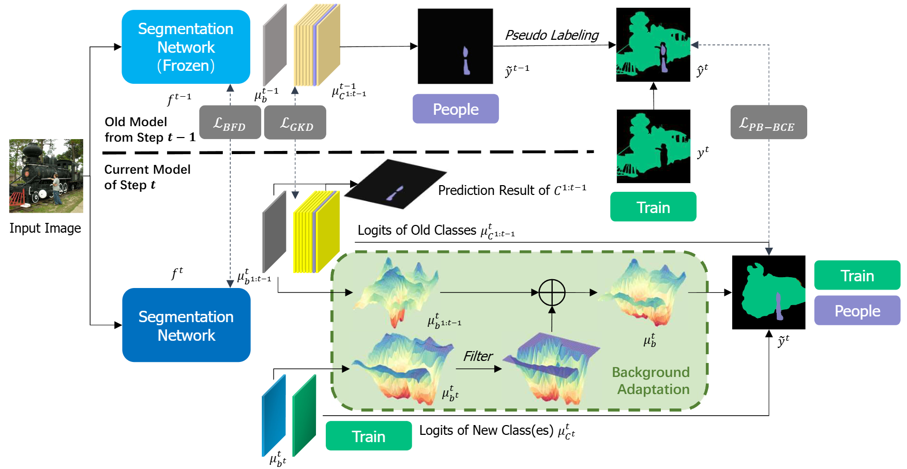
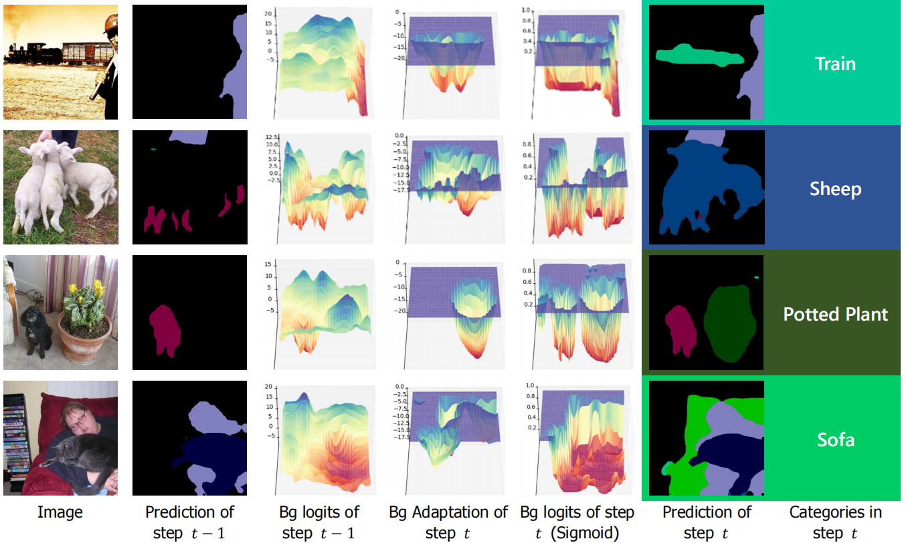
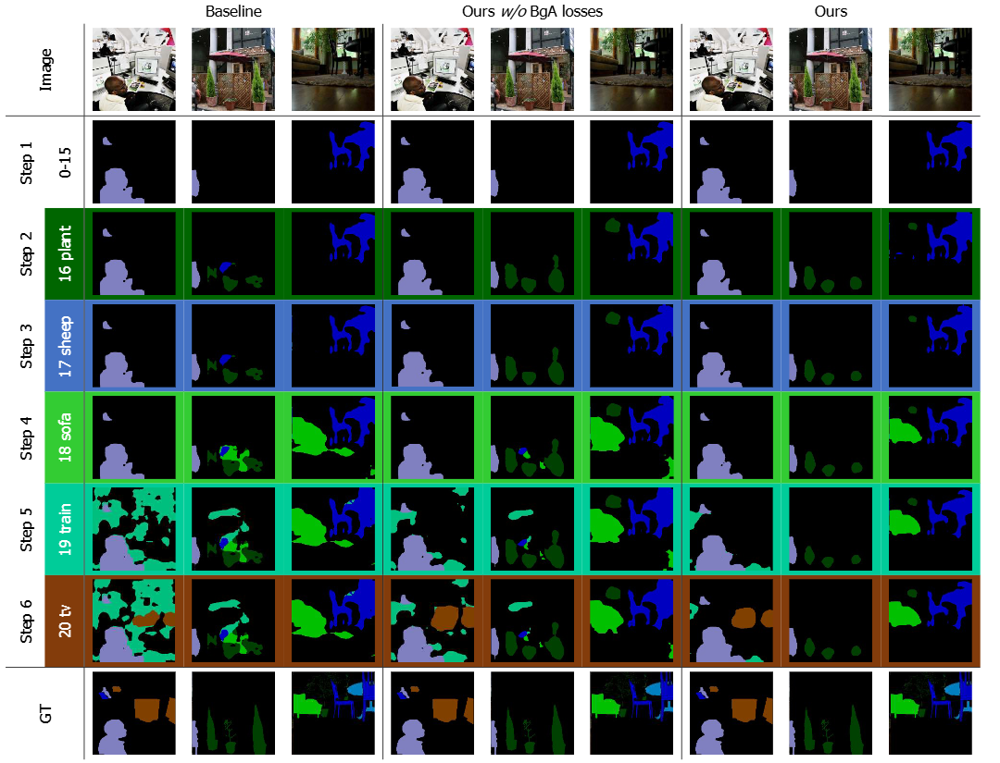

# BARM - Official Pytorch Implementation (ECCV 2024)

**Background Adaptation with Residual Modeling for Exemplar-Free
Class-Incremental Semantic Segmentation** <br />
Anqi Zhang<sup>1</sup>, Guangyu Gao<sup>1</sup>

<sup>1</sup> <sub>School of Computer Science and Technology, Beijing Institute of Technology, Beijing, China</sub><br />

Accepted in ECCV 2024 <br />

[](https://arxiv.org/abs/2106.11562)


## Preparation

### Requirements

- CUDA>=11.8
- torch>=2.0.0
- torchvision>=0.15.0
- numpy
- pillow
- scikit-learn
- tqdm
- matplotlib


### Datasets

We use the Pascal VOC 2012 and ADE20K datasets for evaluation following the previous methods. You can download the datasets from the following links:

Download Pascal VOC 2012 dataset:
```bash
wget http://host.robots.ox.ac.uk/pascal/VOC/voc2012/VOCtrainval_11-May-2012.tar
```
Download Additional Segmentation Class Annotations:
```bash
wget https://www.dropbox.com/s/oeu149j8qtbs1x0/SegmentationClassAug.zip
```

Download ADE20K dataset:
```bash
wget http://data.csail.mit.edu/places/ADEchallenge/ADEChallengeData2016.zip
```


```
data_root/
   ├── VOC2012/
   │   ├── Annotations/
   │   ├── ImageSet/
   │   ├── JPEGImages/
   │   ├── SegmentationClassAug/
   │   └── saliency_map/
   └── ADEChallengeData2016
       ├── annotations
       │   ├── training
       │   └── validation
       └── images
           ├── training
           └── validation
```

## Getting Started

### Class-Incremental Segmentation Segmentation on VOC 2012

Run our scripts `run_init.sh` and `run.sh` for class-incremental segmentation on VOC 2012 dataset, or follow the instructions below.

Initial step: 
```bash
MODEL=deeplabv3bga_resnet101
DATA_ROOT= # Your dataset root path
DATASET=voc
TASK=15-1
EPOCH=50
BATCH=16
LOSS=bce_loss
LR=0.001
THRESH=0.7
SUBPATH=BARM
CURR=0

CUDA_VISIBLE_DEVICES=0 \
python train.py --data_root ${DATA_ROOT} --model ${MODEL} --crop_val --lr ${LR} \
    --batch_size ${BATCH} --train_epoch ${EPOCH}  --loss_type ${LOSS} \
    --dataset ${DATASET} --task ${TASK} --lr_policy poly \
    --pseudo --pseudo_thresh ${THRESH}  --bn_freeze  --amp \
    --curr_step ${CURR} --subpath ${SUBPATH} --initial --overlap 
```

Incremental steps:
```bash
MODEL=deeplabv3bga_resnet101
DATA_ROOT= # Your dataset root path
DATASET=voc
TASK=15-1
EPOCH=20
BATCH=8
LOSS=bce_loss
LR=0.001
THRESH=0.7
SUBPATH=BARM
CURR=1

CUDA_VISIBLE_DEVICES=0,1 \
torchrun --nproc_per_node=2 --master_port=11451 \
train.py --data_root ${DATA_ROOT} --model ${MODEL} --crop_val --lr ${LR} \
    --batch_size ${BATCH} --train_epoch ${EPOCH}  --loss_type ${LOSS} \
    --dataset ${DATASET} --task ${TASK} --lr_policy poly \
    --pseudo --pseudo_thresh ${THRESH}  --bn_freeze  --amp\
    --curr_step ${CURR} --subpath ${SUBPATH} --overlap
```

### Class-Incremental Segmentation Segmentation on ADE20K

Run our scripts `run_init.sh` and `run.sh` for class-incremental segmentation on ADE20K dataset, or follow the instructions below.

Initial step: 
```bash
MODEL=deeplabv3bga_resnet101
DATA_ROOT= # Your dataset root path
DATASET=ade
TASK=100-5
EPOCH=60
BATCH=8
LOSS=bce_loss
LR=0.001
THRESH=0.7
SUBPATH=BARM
CURR=0

CUDA_VISIBLE_DEVICES=0 \
python train.py --data_root ${DATA_ROOT} --model ${MODEL} --crop_val --lr ${LR} \
    --batch_size ${BATCH} --train_epoch ${EPOCH}  --loss_type ${LOSS} \
    --dataset ${DATASET} --task ${TASK} --lr_policy poly \
    --pseudo --pseudo_thresh ${THRESH}  --bn_freeze  --amp \
    --curr_step ${CURR} --subpath ${SUBPATH} --initial --overlap 
```

Incremental steps:
```bash
MODEL=deeplabv3bga_resnet101
DATA_ROOT= # Your dataset root path
DATASET=ade
TASK=100-10
EPOCH=100
BATCH=4
LOSS=bce_loss
LR=0.01
THRESH=0.7
SUBPATH=BARM
CURR=1

CUDA_VISIBLE_DEVICES=0,1 \
torchrun --nproc_per_node=2 --master_port=19198 \
train.py --data_root ${DATA_ROOT} --model ${MODEL} --crop_val --lr ${LR} \
    --batch_size ${BATCH} --train_epoch ${EPOCH}  --loss_type ${LOSS} \
    --dataset ${DATASET} --task ${TASK} --lr_policy poly \
    --pseudo --pseudo_thresh ${THRESH}  --bn_freeze  --amp \
    --curr_step ${CURR} --subpath ${SUBPATH} --overlap
```


## Experiment Results

### Quantitative Results

The following table shows the mIoU results of different methods on the Pascal VOC 2012 and ADE20K dataset. 
Our trained weights are available at [123Pan](https://www.123pan.com/s/VOFbVv-grcsH.html). 

|  Method  | VOC 10-1 (11 tasks) | VOC 15-1 (6 tasks) | VOC 5-3 (6 tasks) | VOC 19-1 (2 tasks) |
|:--------:|:-------------------:|:------------------:|:-----------------:|:------------------:|
|   MiB    |        12.7         |        29.3        |       46.7        |        69.2        |
|   PLOP   |        30.5         |        54.6        |       18.7        |        73.5        |
|   DKD    |        60.4         |        69.7        |       58.1        |        76.0        |
| **BARM** |      **62.1**       |      **70.0**      |     **61.1**      |      **76.4**      |

|   Method   | ADE 100-5 (11 tasks) | ADE 100-10 (6 tasks) | ADE 100-50 (2 tasks) | ADE 50-50 (3 tasks) |
|:----------:|:--------------------:|:--------------------:|:--------------------:|:-------------------:|
|    MiB     |         26.0         |         29.2         |         32.8         |        29.3         |
|    PLOP    |         28.8         |         31.6         |         32.9         |        30.4         |
|    DKD     |          -           |         34.3         |         36.0         |        33.9         |
| **SSUL-M** |       **34.1**       |       **35.2**       |       **35.7**       |      **33.7**       |


### Qualitative Results




## Citation
```
@inproceedings{zhang2024background,
  title={Background Adaptation with Residual Modeling for Exemplar-Free Class-Incremental Semantic Segmentation},
  author={Zhang, Anqi and Gao, Guangyu},
  journal={ECCV},
  year={2024}
}
```

## Acknowledgement

Our implementation is based on these repositories: [DeepLabV3Plus-Pytorch](https://github.com/VainF/DeepLabV3Plus-Pytorch), [SSUL](https://github.com/clovaai/SSUL).
Thanks for their great work!


